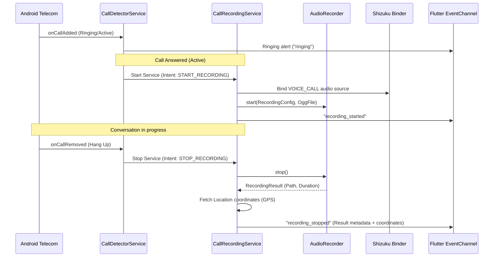

# Shuni System Architecture

This document describes the high-level architecture, data flows, and design patterns implemented in Shuni.

---

## 🏛️ Layered Architecture

Shuni implements a clean, layered design that separates UI rendering, business logic, platform bindings, and native OS APIs:

```
┌────────────────────────────────────────────────────────┐
│                      UI LAYER (Dart)                   │
│        Home Screen, Lock Screen, Map View, Player      │
└───────────────────────────┬────────────────────────────┘
                            ▼
┌────────────────────────────────────────────────────────┐
│                   STATE MANAGERS (Riverpod)            │
│    CallRecordsProvider, RecordingProvider, AuthState   │
└───────────────────────────┬────────────────────────────┘
                            ▼
┌────────────────────────────────────────────────────────┐
│                   SERVICES LAYER (Dart)                │
│    DatabaseService, LocationService, BackupService     │
└───────────────────────────┬────────────────────────────┘
                            ▼
┌────────────────────────────────────────────────────────┐
│                PLATFORM CHANNELS BRIDGE                │
│       MethodChannel (com.shuni/core) (Dart ↔ Kotlin)   │
│       EventChannel (com.shuni/call_events)             │
└───────────────────────────┬────────────────────────────┘
                            ▼
┌────────────────────────────────────────────────────────┐
│               NATIVE ANDROID ENGINE (Kotlin)           │
│    CallRecordingService, CallDetector, ShizukuBridge   │
└───────────────────────────┬────────────────────────────┘
                            ▼
┌────────────────────────────────────────────────────────┐
│                 SYSTEM SERVICES & HARDWARE             │
│      Android Telecom, MediaRecorder, Google GPS,       │
│                Shizuku Privileged Binders              │
└────────────────────────────────────────────────────────┘
```

---

## 🔄 Core Data Flows

### Call Detection and Recording Lifecycle



---

## 💾 Local Storage Layout

Recordings and databases are saved in a shared public directory under `/storage/emulated/0/Shuni/` so that they survive app uninstalls and can be backed up manually by the user:

```
/storage/emulated/0/Shuni/
├── recordings/                       # Public Ogg voice clips
│   ├── 2026-07-11_23-30-15_John_Doe_incoming.ogg
│   ├── 2026-07-11_23-45-02_Unknown_outgoing.ogg
│   └── ...
└── .shuni_db/                        # Hidden system folder
    ├── shuni.db                      # SQLite local database
    └── .nomedia                      # Prevents folders indexing by music apps
```

### Database Schema

#### `call_records` Table
- `id`: `INTEGER PRIMARY KEY AUTOINCREMENT`
- `phone_number`: `TEXT NOT NULL`
- `contact_name`: `TEXT NOT NULL`
- `date_time_ms`: `INTEGER NOT NULL` (Epoch timestamp)
- `duration_seconds`: `INTEGER NOT NULL`
- `direction`: `TEXT NOT NULL` (`incoming` | `outgoing`)
- `audio_file_path`: `TEXT NOT NULL`
- `file_size_bytes`: `INTEGER NOT NULL`
- `latitude`: `REAL`
- `longitude`: `REAL`
- `address`: `TEXT`
- `is_bookmarked`: `INTEGER DEFAULT 0` (Boolean 0/1)
- `notes`: `TEXT`
- `is_voip`: `INTEGER DEFAULT 0`

#### `app_settings` Table
- `id`: `INTEGER PRIMARY KEY CHECK (id = 1)`
- `auto_record`: `INTEGER DEFAULT 1`
- `biometric_lock`: `INTEGER DEFAULT 0`
- `pin_lock`: `INTEGER DEFAULT 0`
- `auto_lock_seconds`: `INTEGER DEFAULT 0`
- `auto_backup`: `INTEGER DEFAULT 0`
- `backup_wifi_only`: `INTEGER DEFAULT 1`
- `audio_quality`: `TEXT DEFAULT 'high'`
- `show_overlay`: `INTEGER DEFAULT 1`
- `cleanup_days`: `INTEGER`
